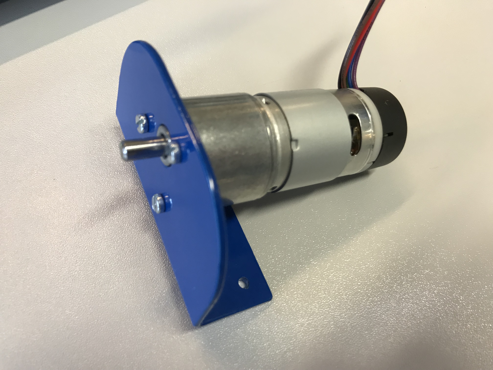
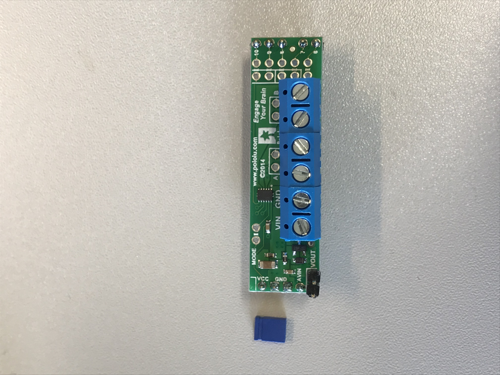
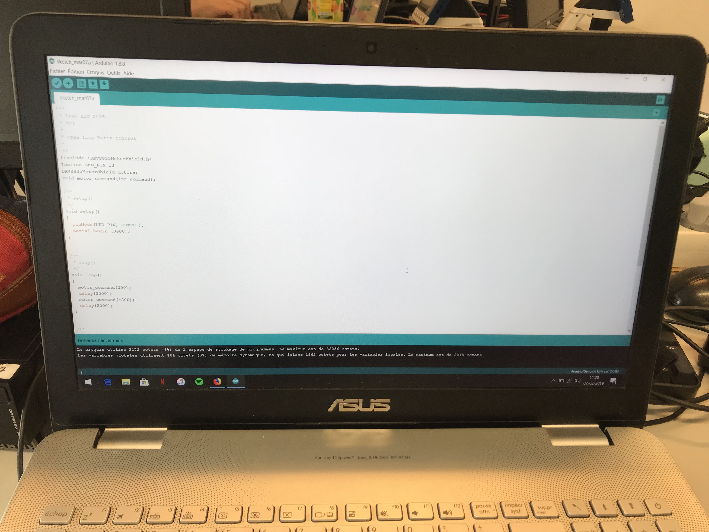
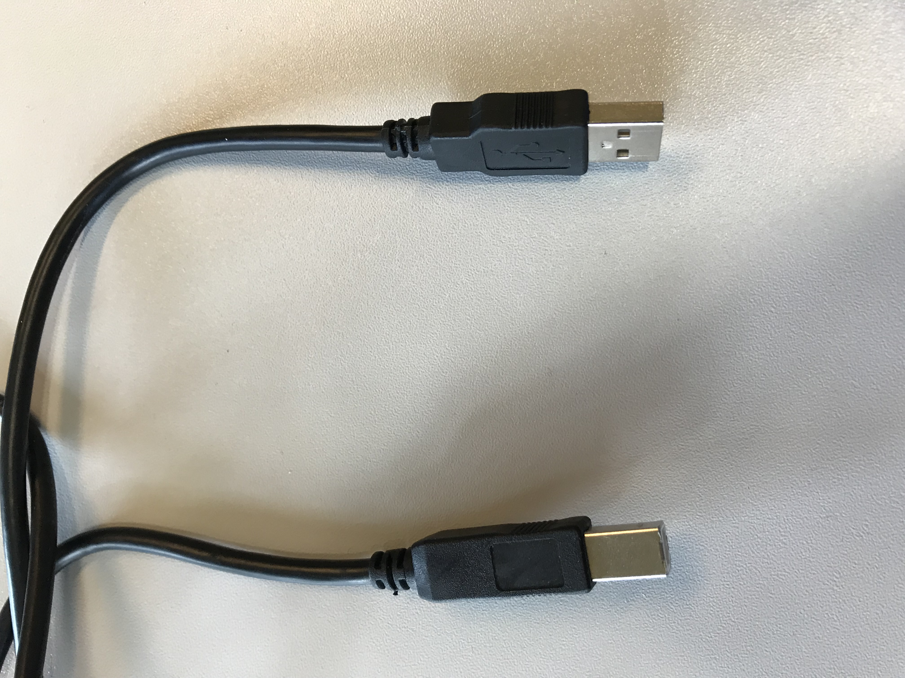
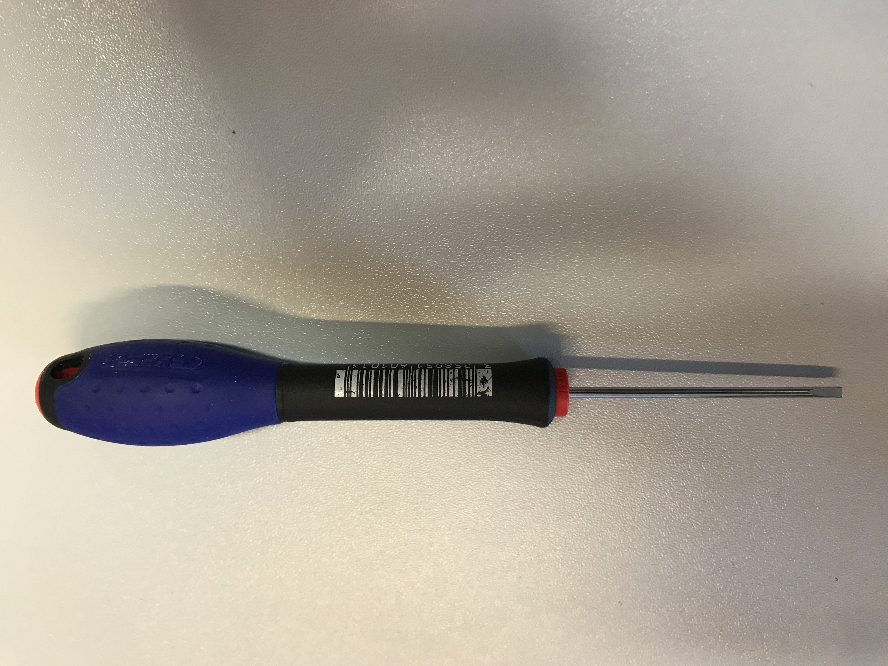
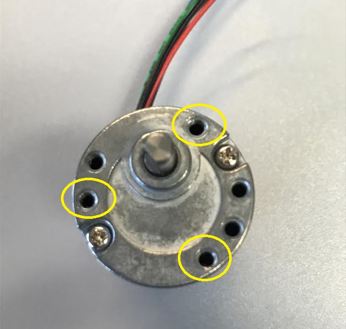
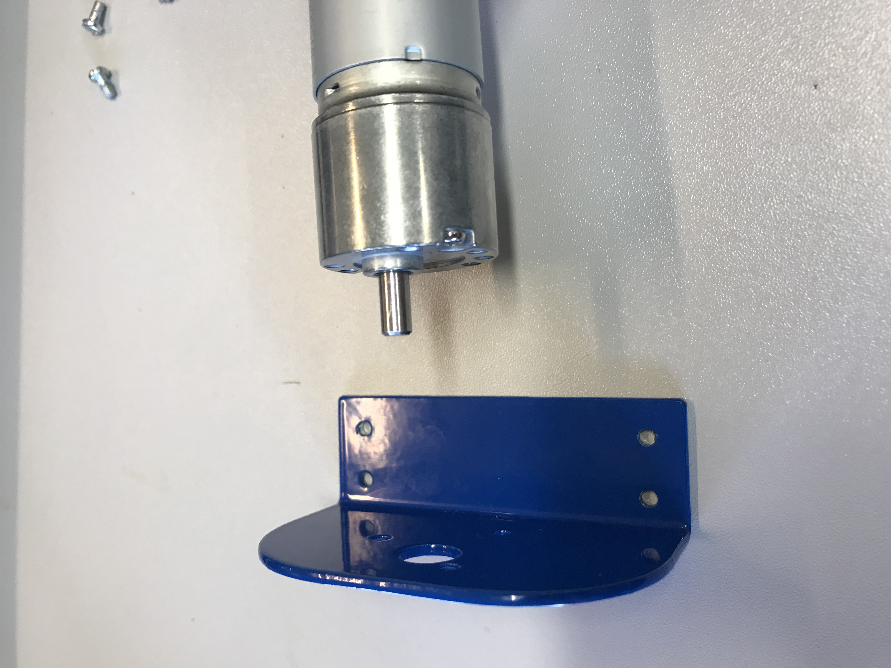
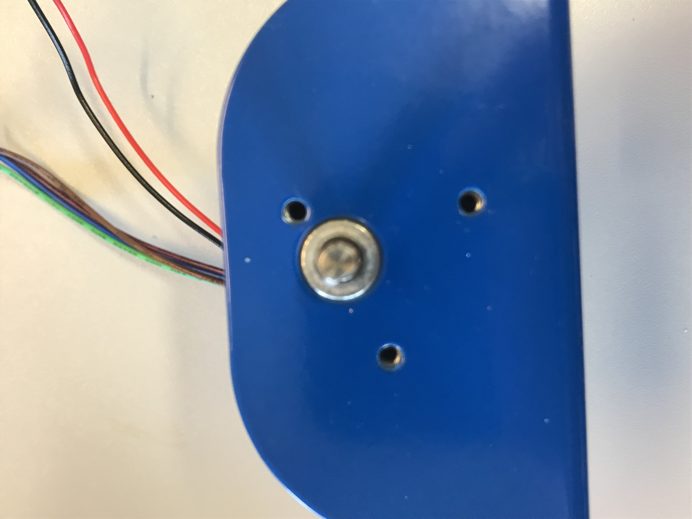
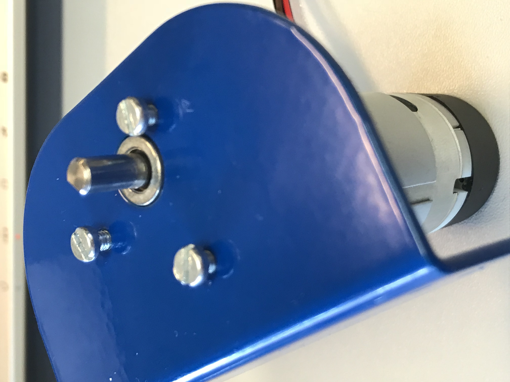
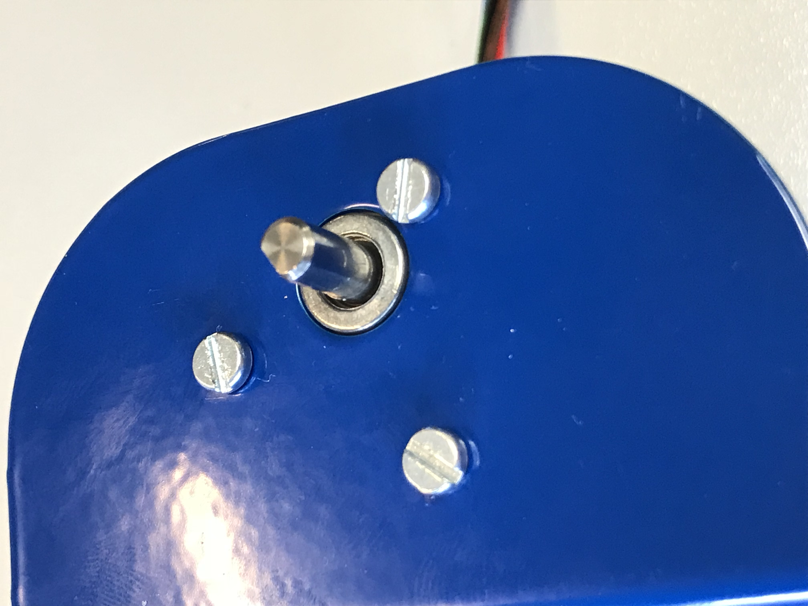

# LPro AIT 2019 - TP1 - Assembly procedure : motor to the arduino

- Names
    - Loris ARNAUD
    - Augustin GARES

The 7th of March of 2019

## 1. Hardware list

1. EMG30 motor with blue support assembly X1

     

2. Arduino Uno X1

    

3. Arduino shield - Pololu DRV8835 Dual Motor Driver with jumper X1

    

4. Laptop X1

    
    
5. USB câble X1

    

## 2. Tools

1. Flathead screwdriver X1

    

## 3. Assembly procedure : motor to the arduino

### First step
    Put the motor axis into the big hole of the blue support, like on the pictures. Warning, holes in yellow circles may be in front of the 3 holes of the blue support.

1. 
    

2. 
    

3. 
    

### Second step
    Put the 3 srew into the 3 holes and screw them.

1. 
    

2. 
    

### Results
    At the end, the result look like this:

 