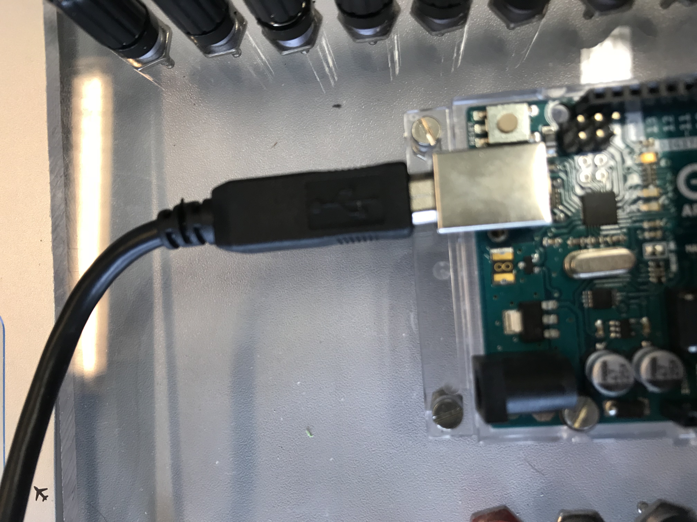
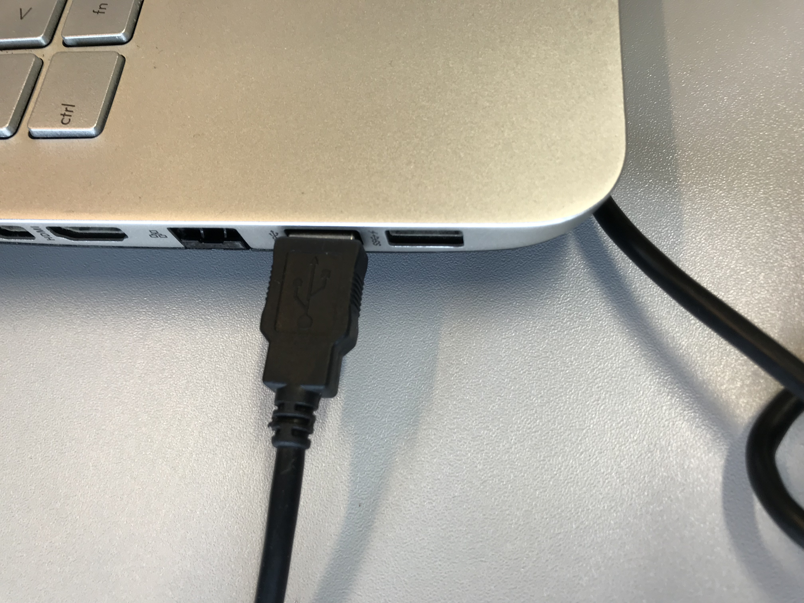
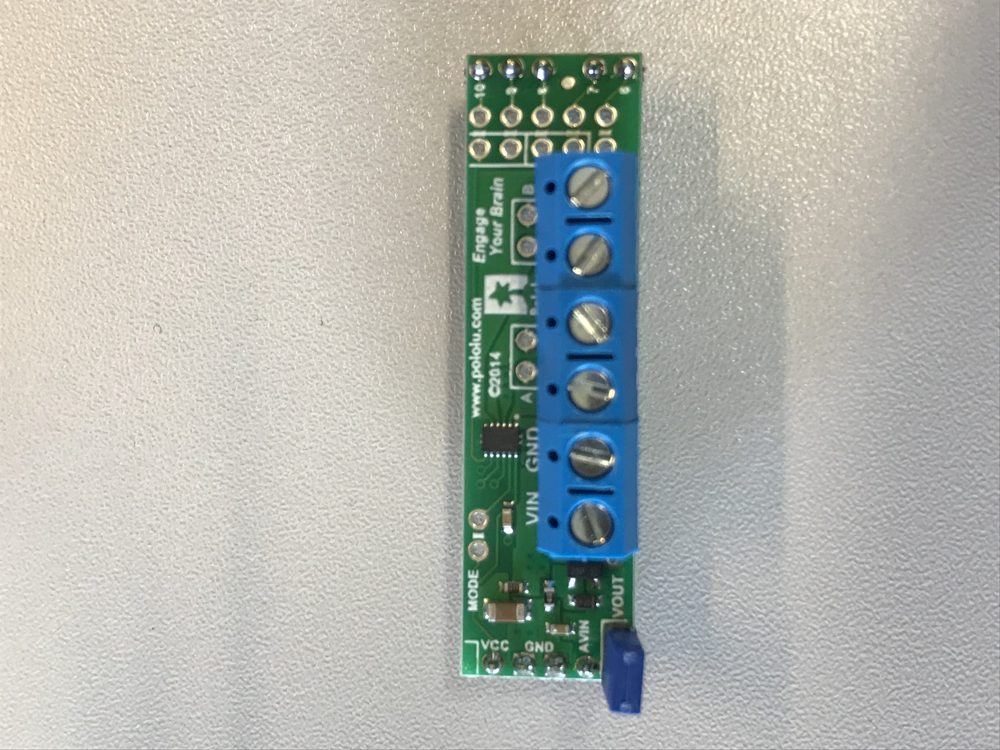
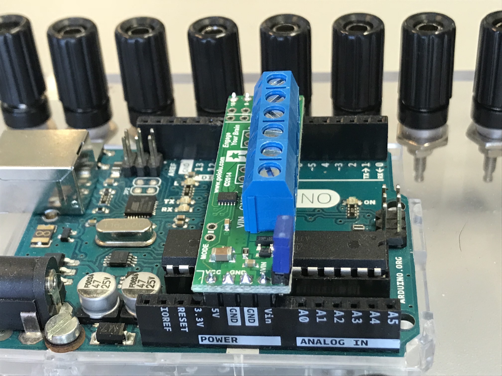
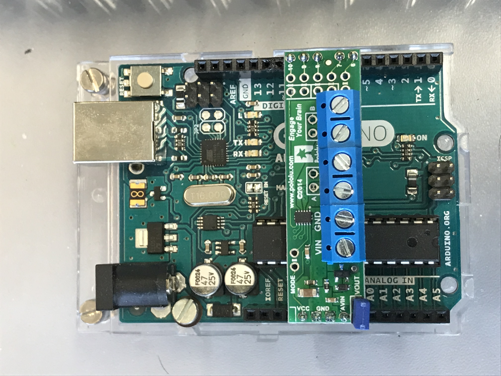
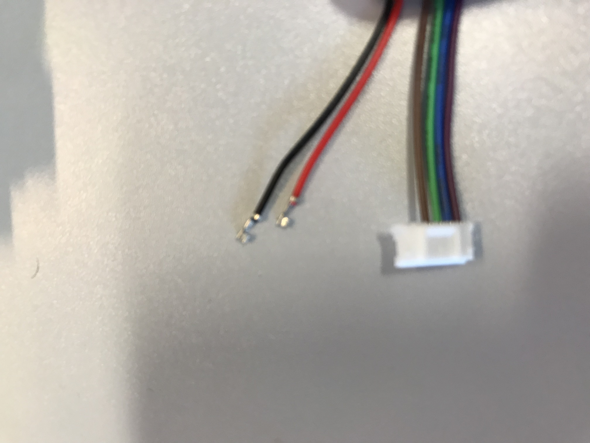
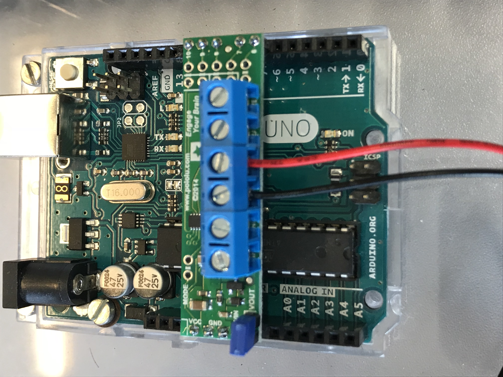
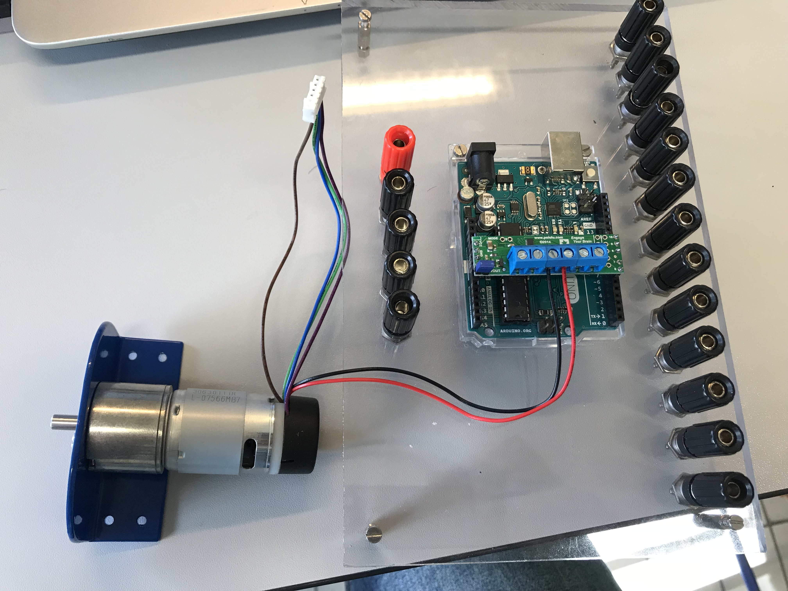

# Correction
* Put **/procedures** and **/pictures** folders in **/docs**.
* Exact same remarks as the other procedure.... please read them!

# LPro AIT 2019 - TP1 - Assembly procedure : motor to the arduino

- Names
    - Loris ARNAUD
    - Augustin GARES

The 7th of March of 2019

## 1. Hardware list

1. EMG30 motor with blue support assembly X1

     

2. Arduino Uno X1

    

3. Arduino shield - Pololu DRV8835 Dual Motor Driver with jumper X1

    

4. Laptop X1

    
    
5. USB câble X1

    

## 2. Tools

1. Flathead screwdriver X1

    

## 3. Assembly procedure : motor to the arduino

### First step
    Download the arduino program motor_control_open_loop on the laptop.

1. 
    

### Second step
    Download the DRV8835MotorShield librarie into the arduino IDE.

### Third step
    Wire the laptop to the arduino with the USB cable.

1. 
    

2. 
    

### Fourth step
    Download the software on the arduino UNO and verify if the LED blinks every 2 secondes on the arduino. After, unwire the USB cable from the arduino and the laptop.

### Fifth step
    Put the jumper on the motor shield on the VOUT pin, like on the picture.

1. 
    

### Sixth step
    Pin the arduino shield on the arduino. The Vcc pin of the shield have to be on the 5V pin of the arduino. Verify that pins of the shield are on rights pins of the arduino.

1. 
    

2. 
    

### Seventh step
   Plug the red and black wires of motor in the M1B and M1A pins of the motor shield.

1. 
    

2. 
    

### Results
    At the end, the result look like this:

 